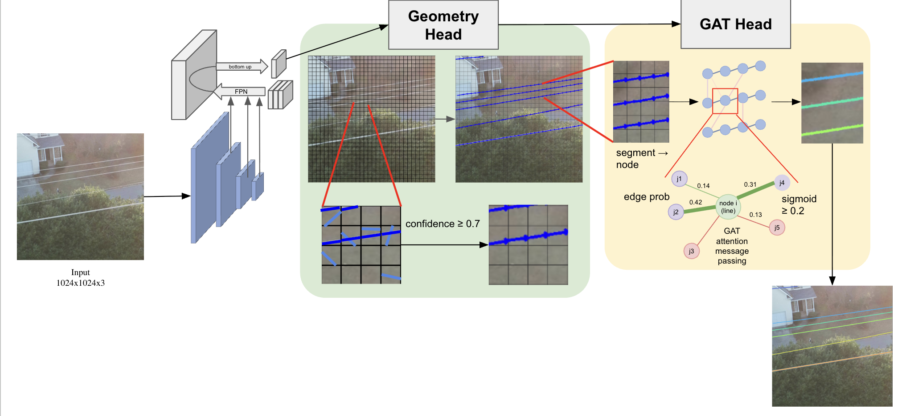
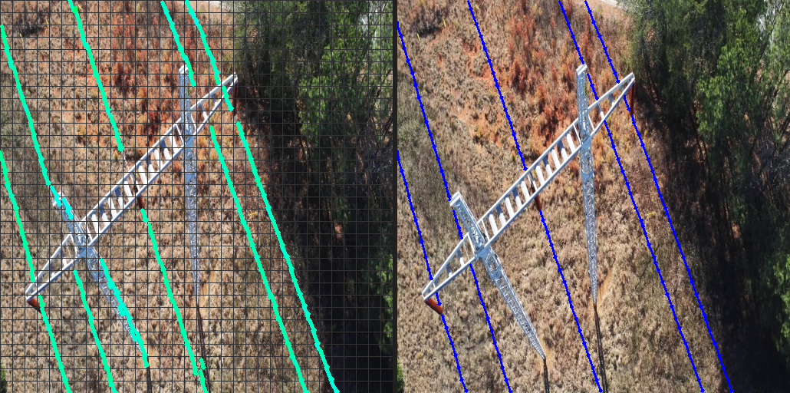

# CAPSTONE: Powerline Detection with YOLinO + GNN

**[Korea Institute of Energy Technology](https://www.kentech.ac.kr/) (KENTECH)**

**Students**

- [**최재영**](https://github.com/V8heart) — agew1597@kentech.ac.kr
- [**최동제**](https://github.com/URIBARI) — cdj0418@kentech.ac.kr
- [**강원용**](https://github.com/wonyong-3927) — wonyong3927@kentech.ac.kr
- [**이현승**](https://github.com/Ark-sty) — pruina@kentech.ac.kr

**Advisor**

- [**Seokju Lee**](https://github.com/SeokjuLee) — slee@kentech.ac.kr

*Capstone project — [viewlab-group/Capstone26s-PowerLineDetection-dev](https://github.com/viewlab-group/Capstone26s-PowerLineDetection-dev)*

## Abstract

CAPSTONE detects aerial powerlines in TTPLA imagery using a **two-stage** pipeline. **Stage 1** runs a YOLinO-style single-shot detector (ConvNeXt-Tiny + FPN) to predict per-cell line geometry and confidence. **Stage 2** freezes that backbone and trains a **Graph Attention Network (GAT)** on predicted segments to assemble individual wires into instance-level polylines. Datasets and checkpoints are published on Hugging Face; this repository provides training, inference, and experiment configs.

## Model architecture



**Pipeline**
- **Stage 1 (`exp80`)** — train YOLinO geometry + confidence (ConvNeXt-Tiny, FPN, 512×512, scale 16 / P3).
- **Stage 2 (`exp82`)** — freeze the geom backbone and train the GNN post-processor on top of Stage 1 weights (GNN settings from `exp71`).

Large artifacts (dataset & checkpoints) are hosted on [Hugging Face](https://huggingface.co/V8heart); this repo contains code and experiment configs only.

## Results (preview)

| Stage | Config | Description |
|-------|--------|-------------|
| **Stage 1** | `exp80` | YOLinO geom + confidence (pred \| GT, conf ≥ 0.7) |
| **Stage 2** | `exp82` | GNN assembly — *coming soon* |

**Stage 1 example** (`71_4520`, val split):



**Stage 2 example:** *TBD after `exp82` training completes.*

---

## Requirements

- Python 3.10+ (tested with the project venv below)
- CUDA-capable GPU(s) for training (4-GPU DDP by default)
- [`huggingface_hub`](https://huggingface.co/docs/huggingface_hub) CLI (`hf`) for downloading data/weights

### Virtual environment

We use a **Python venv** (not conda) for this project:

```bash
# create once (example)
python3 -m venv /path/to/venv
source /path/to/venv/bin/activate
pip install -e .

# our server default (also used by run.sh)
# /home/work/caps_drone/yolino/venv/bin/python
```

`run.sh` picks up `PYTHON_BIN` automatically; override if your venv lives elsewhere:

```bash
export PYTHON_BIN=/path/to/venv/bin/python
```

---

## Quick start

```bash
git clone https://github.com/V8heart/CAPSTONE.git
cd CAPSTONE
source /path/to/venv/bin/activate   # or set PYTHON_BIN
pip install -e .
pip install -U huggingface_hub

# download TTPLA benchmark (512×512)
hf download V8heart/yolino-ttpla-benchmark \
  --repo-type dataset \
  --local-dir ./YOLinO_benchmark

export DATASET_TTPLA="$(pwd)/YOLinO_benchmark"

# optional: download Stage 2 checkpoint for inference
hf download V8heart/CAPSTONE-gnn-weights \
  exp81_gnn_ttpla_512512_from_exp80/ep0058_model.pth \
  --repo-type model \
  --local-dir ttpla_train_exp/log/checkpoints/exp81_gnn_ttpla_512512_from_exp80
```

Expected dataset layout:

```
YOLinO_benchmark/
├── images/{train,val,test}/*.png
└── labels/{train,val,test}/*.npy
```

| Resource | Hugging Face | Status |
|----------|--------------|--------|
| TTPLA benchmark (512×512) | [V8heart/yolino-ttpla-benchmark](https://huggingface.co/datasets/V8heart/yolino-ttpla-benchmark) | Available |
| Stage 2 checkpoint (`exp81`, ep58) | [V8heart/CAPSTONE-gnn-weights](https://huggingface.co/V8heart/CAPSTONE-gnn-weights) | Available |

---

## Training

All training goes through `run.sh`, which sets `DATASET_TTPLA`, `PYTHONPATH`, and launches `torch.distributed.run`.

Default: **4 GPUs** (`--nproc 4`, `CUDA_VISIBLE_DEVICES=0,1,2,3`). Adjust to your machine.

### Stage 1 — YOLinO geometry baseline (`exp80`)

Config: `configs/experiments/exp80_ttpla_512512_scale16.yaml`

Trains geom + confidence only (no GNN). Output checkpoint:

```
ttpla_train_exp/log/checkpoints/exp80_ttpla_512512_scale16/best_model.pth
```

```bash
export DATASET_TTPLA="$(pwd)/YOLinO_benchmark"

bash run.sh \
  --config configs/experiments/exp80_ttpla_512512_scale16.yaml \
  --dataset-root "$DATASET_TTPLA" \
  --nproc 4
```

### Stage 2 — GNN head (`exp82`)

Config: `configs/experiments/exp82_gnn_ttpla_512512_from_exp80.yaml`

Warm-starts from Stage 1 `best_model.pth` (`explicit_model` in the YAML). Backbone/geom/FPN are frozen; only the GNN (`e2e_mode: gnn`) is trained. GNN hyperparameters follow `exp71` (`directional2`, BCE edge loss).

```bash
# requires Stage 1 checkpoint at:
# ttpla_train_exp/log/checkpoints/exp80_ttpla_512512_scale16/best_model.pth

bash run.sh \
  --config configs/experiments/exp82_gnn_ttpla_512512_from_exp80.yaml \
  --dataset-root "$DATASET_TTPLA" \
  --nproc 3
```

> Previous Stage 2 experiment: `exp81_gnn_ttpla_512512_from_exp80.yaml` (directional2_ctx + cross_ignore loss).

### Download checkpoint (skip training)

Published on Hugging Face — Stage 2 only (`exp81`, epoch 58):

```bash
hf download V8heart/CAPSTONE-gnn-weights \
  exp81_gnn_ttpla_512512_from_exp80/ep0058_model.pth \
  --repo-type model \
  --local-dir ttpla_train_exp/log/checkpoints/exp81_gnn_ttpla_512512_from_exp80
```

This places the file at:

```
ttpla_train_exp/log/checkpoints/exp81_gnn_ttpla_512512_from_exp80/ep0058_model.pth
```

---

## Inference & evaluation

Run from `ttpla_train_exp/` with the project venv. Use the **Stage 2** config and checkpoint for full GNN assembly.

### Visual prediction (overlay images)

```bash
cd ttpla_train_exp
export DATASET_TTPLA="../YOLinO_benchmark"
export PYTHONPATH="../src"

../venv/bin/python ../src/yolino/predict.py \
  -c ../configs/experiments/exp81_gnn_ttpla_512512_from_exp80.yaml \
  --root .. \
  --dvc . \
  --log_dir ttpla_experiments \
  --split val \
  --gpu \
  --explicit_model log/checkpoints/exp81_gnn_ttpla_512512_from_exp80/ep0058_model.pth
```

Debug images are written under `ttpla_train_exp/debug/prediction/`.

### Metric evaluation

```bash
cd ttpla_train_exp
export DATASET_TTPLA="../YOLinO_benchmark"
export PYTHONPATH="../src"

../venv/bin/python ../src/yolino/eval.py \
  -c ../configs/experiments/exp81_gnn_ttpla_512512_from_exp80.yaml \
  --root .. \
  --dvc . \
  --log_dir ttpla_experiments \
  --split val \
  --gpu \
  --explicit_model log/checkpoints/exp81_gnn_ttpla_512512_from_exp80/ep0058_model.pth
```

Replace `../venv/bin/python` with your `PYTHON_BIN` if the venv path differs.

> **Note:** Experiment YAMLs may contain machine-local `dataset_ttpla` paths. Always set `DATASET_TTPLA` or pass `--dataset-root` via `run.sh` when running on a new machine.

---

## Project layout

```
CAPSTONE/
├── run.sh                          # main training launcher (DDP)
├── configs/experiments/
│   ├── exp80_ttpla_512512_scale16.yaml      # Stage 1
│   ├── exp81_gnn_ttpla_512512_from_exp80.yaml  # Stage 2 (prev.)
│   └── exp82_gnn_ttpla_512512_from_exp80.yaml  # Stage 2 (current)
├── src/yolino/
│   ├── train.py                    # training entry
│   ├── predict.py                  # inference + visualization
│   ├── eval.py                     # evaluation metrics
│   └── model/yolino_gnn_head.py    # GNN assembly head
└── ttpla_train_exp/
    └── log/checkpoints/            # saved weights (gitignored)
```

---

## References

If you use this code, please cite the original YOLinO paper and the GAT architecture used in our graph head:

```bibtex
@inproceedings{meyer2021yolino,
  title={YOLinO: Generic Single Shot Polyline Detection in Real Time},
  author={Meyer, Annika and Skudlik, Philipp and Pauls, Jan-Hendrik and Stiller, Christoph},
  booktitle={Proceedings of the IEEE/CVF International Conference on Computer Vision Workshops},
  pages={2916--2925},
  year={2021}
}

@inproceedings{velickovic2018graph,
  title={Graph Attention Networks},
  author={Veli{\v{c}}kovi{\'c}, Petar and Cucurull, Guillem and Casanova, Arantxa and Romero, Adriana and Li{\`o}, Pietro and Bengio, Yoshua},
  booktitle={International Conference on Learning Representations},
  year={2018}
}
```

**Links**
- YOLinO (upstream): https://github.com/KIT-MRT/YOLinO
- Graph Attention Networks: https://arxiv.org/abs/1710.10903
- TTPLA dataset (original): cite the TTPLA source paper when using the benchmark tiles

---

## Acknowledgments

This project extends the open-source [YOLinO](https://github.com/KIT-MRT/YOLinO) framework (Karlsruhe Institute of Technology). CAPSTONE-specific changes focus on TTPLA powerline detection with a GNN-based instance assembly stage, developed at the [Korea Institute of Energy Technology](https://www.kentech.ac.kr/) under the supervision of [Seokju Lee](https://github.com/SeokjuLee).
